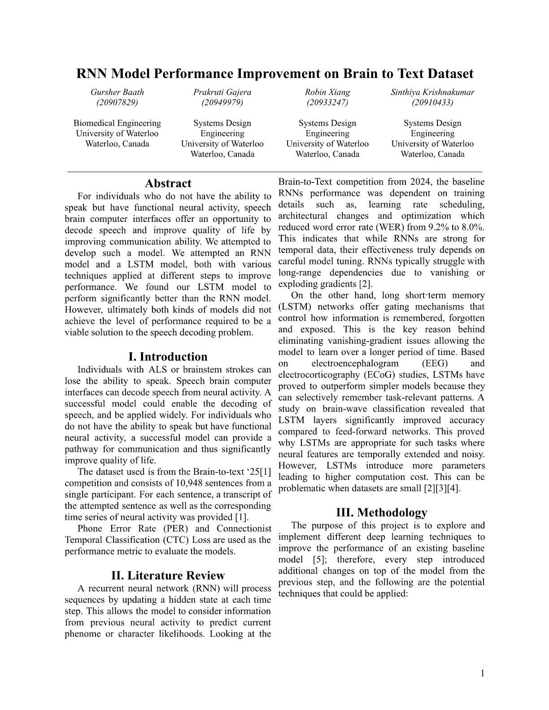
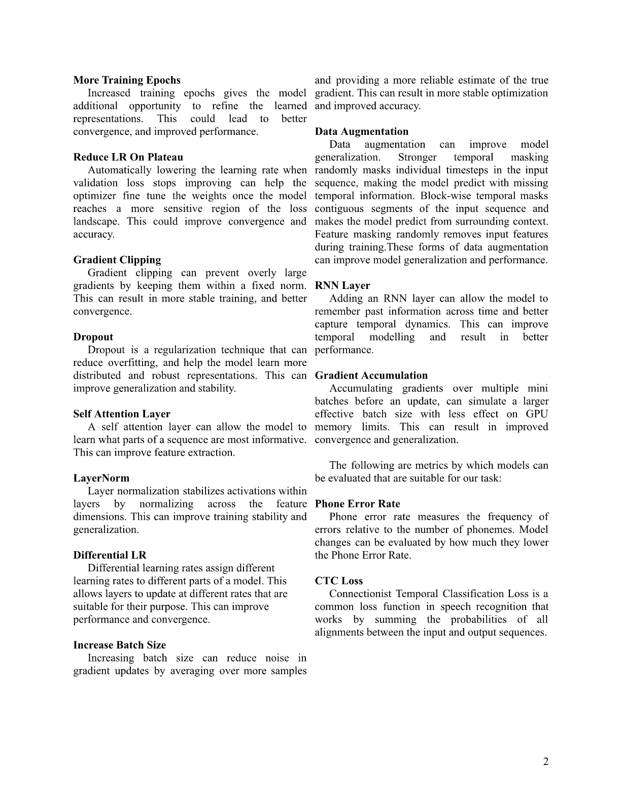
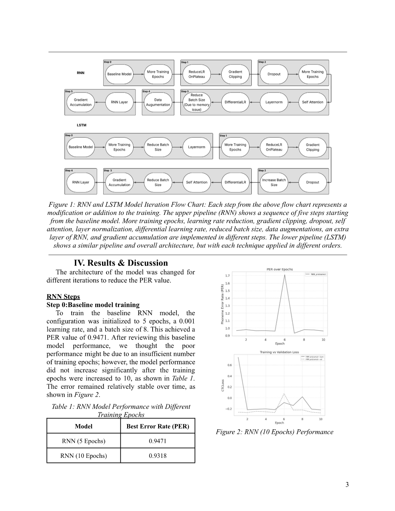
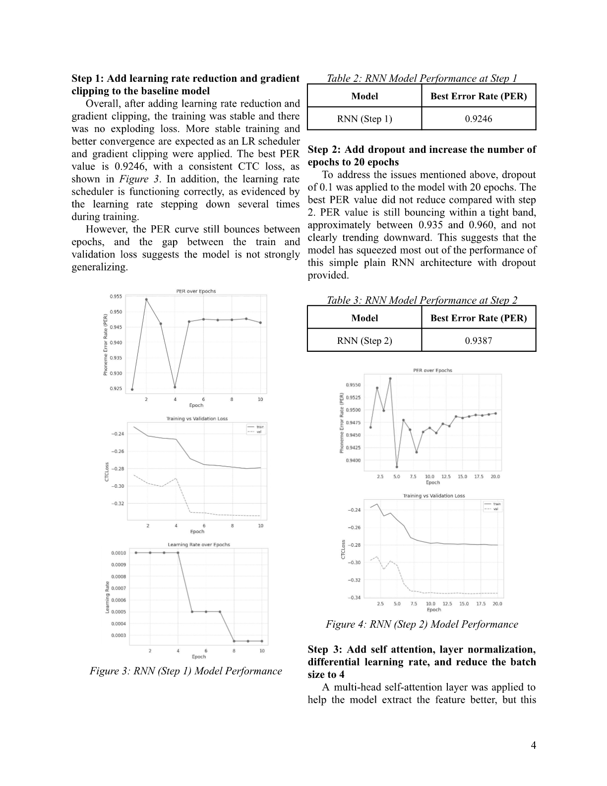
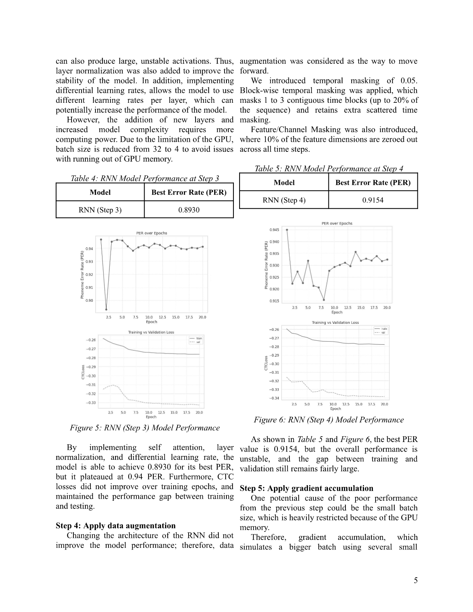
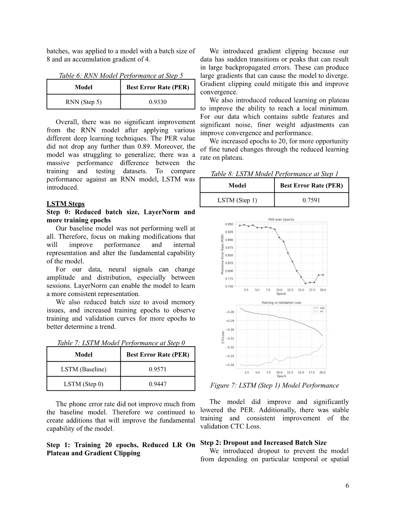
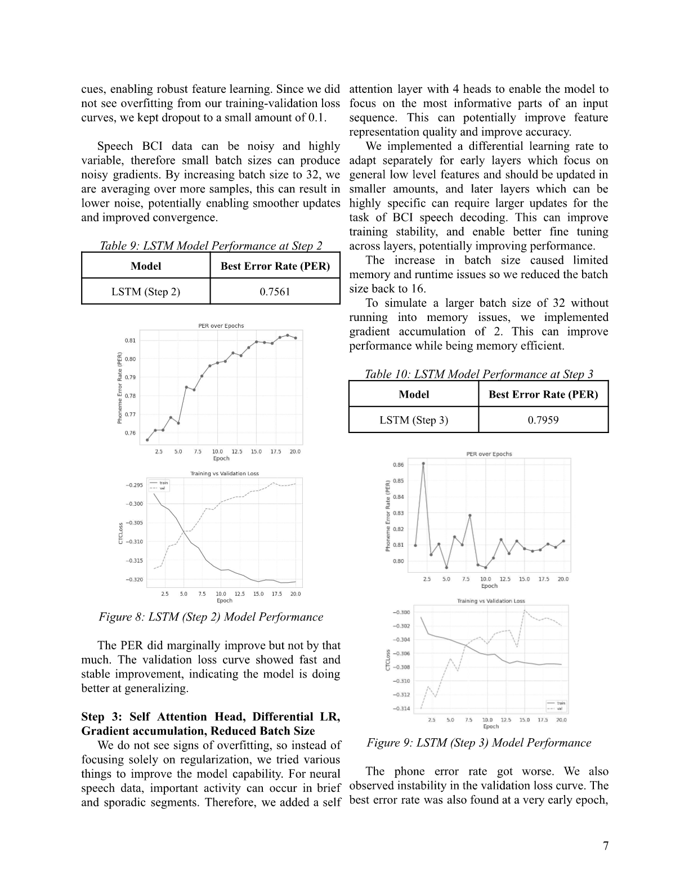
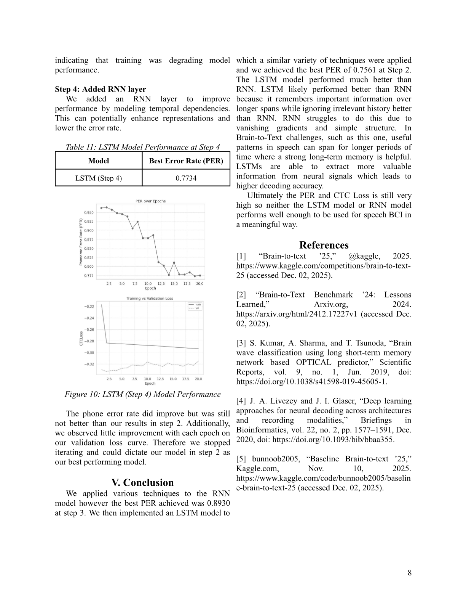

# Neural-Signal-Processing
For individuals without the ability to speak but functional neural activity, speech brain computer interfaces offer an opportunity to decode speech and improve quality of life. This project aims to decode neural activity from ALS patients into speech. We attempted RNN and LSTM models with optimization techniques to improve convergence. Deep learning architectures were implemented using PyTorch.

